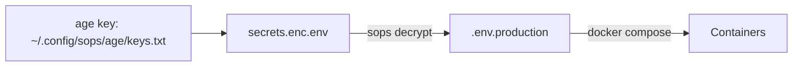

Every Docker Compose stack you deploy needs credentials. Database
passwords, API tokens, SMTP credentials, admin usernames, TLS
private keys. In a typical homelab with 15-20 containers, you
accumulate dozens of secrets scattered across compose files,
`.env` files, and shell scripts.

The default approach — hardcode everything in `docker-compose.yml`
or dump it in a `.env` file in the same directory — works until
it doesn't. A misplaced commit, a backup that lands on the wrong
drive, or a visitor poking around your terminal history reveals
every credential in plaintext.

This guide walks through four tiers of Docker secrets management
for homelab environments, from dead simple to properly vault-backed.
Each tier builds on the previous one, so you can start where you
are and level up as your paranoia (or exposure) grows.

---

## Tier 1 — Better .env Hygiene (The Baseline)

If you're not using `.env` files yet, start here. If you are,
clean them up.

### Stop Hardcoding Everything

Don't do this:

```yaml
# ❌ Bad — secrets in plaintext in compose file
services:
  postgres:
    environment:
      POSTGRES_PASSWORD: my-super-secret-password
```

Do this:

```yaml
# ✅ Good — secrets come from .env
services:
  postgres:
    environment:
      POSTGRES_PASSWORD: ${PG_PASS:?Set PG_PASS in .env}
```

The `:?` syntax causes Docker Compose to fail at startup with a
clear error message instead of substituting an empty string:

```bash
docker compose up -d
# ❌ The variable "PG_PASS" is not set. Set PG_PASS in .env
```

### Structure Your .env Files

A single flat `.env` in the project root is fine for small stacks.
For larger setups, use separate files for different environments:

```bash
/opt/authentik/
├── docker-compose.yml
├── .env.production      # Live credentials
├── .env.staging         # Staging/test credentials
├── .env.example         # Template with placeholder values (committed to git)
├── .gitignore           # Includes .env.production .env.staging
└── secrets/             # Git-ignored directory for sensitive files
```

Reference the file explicitly in your compose command:

```bash
docker compose --env-file .env.production up -d
```

### .gitignore Is Your Safety Net

```gitignore
# /opt/authentik/.gitignore
.env
.env.*
secrets/
*.key
*.pem
!*.example
```

If you version-control your compose files (and you should), the
`.gitignore` prevents secrets from ever landing in a repo. Test
it:

```bash
git add --dry-run .
# Verify no .env or secrets/ files are staged
```

### Generate Secrets Automatically

Stop typing passwords. Generate them at deployment:

```bash
# /opt/authentik/setup.sh
#!/bin/bash
ENV_FILE=".env.production"

cat > "$ENV_FILE" << EOF
# Auto-generated $(date +%Y-%m-%d)
PG_PASS=$(openssl rand -base64 32)
AUTHENTIK_SECRET_KEY=$(openssl rand -base64 48)
AUTHENTIK_BOOTSTRAP_PASSWORD=$(openssl rand -base64 16)
AUTHENTIK_BOOTSTRAP_EMAIL=admin@example.com
EOF

chmod 600 "$ENV_FILE"
echo "Credentials written to $ENV_FILE — save them in your vault!"
```

This is the bare minimum. Every homelab should be here. The
remaining tiers add encryption and rotation.

---

## Tier 2 — Docker Secrets for Sensitive Files

Docker has a built-in secrets feature that works natively in
Swarm mode and is available in standalone Compose via file-based
secrets.

### Compose File-Based Secrets

For `docker compose` (not Swarm), secrets are files mounted into
the container at runtime:

```yaml
# /opt/app/docker-compose.yml
services:
  app:
    image: my-app:latest
    secrets:
      - db_password
      - api_key
      - tls_cert
    environment:
      # Reference secret file paths
      DB_PASSWORD_FILE: /run/secrets/db_password
      API_KEY_FILE: /run/secrets/api_key

secrets:
  db_password:
    file: ./secrets/db_password.txt
  api_key:
    file: ./secrets/api_key.txt
  tls_cert:
    file: ./certs/server.pem
```

Inside the container, each secret is available as a plaintext file
at `/run/secrets/<name>`. The application reads the file path
from the `_FILE` environment variable.

### Why Use Docker Secrets Over Environment Variables

| Concern | Environment Variables | Docker Secrets (file) |
|---------|----------------------|----------------------|
| Visible in `docker inspect` | Yes (plaintext) | No (file path only) |
| Visible in `/proc` | Yes | No |
| Leaked in error traces | Common | Unlikely |
| Leaked in `docker logs` | If printed at startup | Only if app reads + prints |
| Readable by child processes | Yes | Only if mounted readable |
| File permissions | N/A | 0400 by default (root) |
| IDE auto-complete logs | Can leak | No |

The key advantage: a secret mounted as a file never appears in
`docker inspect` output, `docker logs`, or environment dumps.
This matters when you paste logs into a forum or bug report.

### Database Password Example

Most Docker images (Postgres, MySQL, Authentik) support the
`_FILE` suffix convention:

```yaml
services:
  postgres:
    image: postgres:16-alpine
    secrets:
      - pg_pass
    environment:
      POSTGRES_PASSWORD_FILE: /run/secrets/pg_pass
      POSTGRES_USER_FILE: /run/secrets/pg_user

secrets:
  pg_pass:
    file: ./secrets/pg_pass.txt
  pg_user:
    file: ./secrets/pg_user.txt
```

### Create Secrets Securely

```bash
mkdir -p secrets
chmod 700 secrets

# Generate and write in one step with restricted permissions
openssl rand -base64 32 | tee secrets/pg_pass.txt | wc -c
chmod 600 secrets/pg_pass.txt

echo "admin" > secrets/pg_user.txt
chmod 600 secrets/pg_user.txt
```

### Git Ignore the Secrets Directory

```gitignore
# In project .gitignore
secrets/
*.txt
```

---

## Tier 3 — SOPS with age (Encrypted at Rest)

Files on disk are still plaintext. If someone gains access to your
server and reads `secrets/pg_pass.txt`, the game is over. SOPS
(Secrets OPerationS) by Mozilla encrypts your secrets at rest and
decrypts them only at deployment time.

### How SOPS Works with age

SOPS supports multiple encryption backends: age, PGP, AWS KMS,
GCP KMS, and Azure Key Vault. For homelab use, **age** (Actually
Good Encryption) is the sweet spot — simpler than PGP, no key
server dependency, single file key.



### Step 1 — Install SOPS and age

```bash
# Install age
sudo apt install age -y  # or download from GitHub releases

# Install SOPS
SOPS_VERSION="3.9.4"
wget https://github.com/getsops/sops/releases/download/v${SOPS_VERSION}/sops-v${SOPS_VERSION}.linux.amd64
sudo mv sops-v${SOPS_VERSION}.linux.amd64 /usr/local/bin/sops
sudo chmod +x /usr/local/bin/sops
```

### Step 2 — Generate an age Key Pair

```bash
# Generate a new key
age-keygen -o ~/.config/sops/age/keys.txt

# This produces output like:
# public key: age1abc123def456...
```

**Protect this key.** If you lose `keys.txt`, all your encrypted
secrets are permanently unrecoverable. Back it up to your password
manager, offline USB drive, and a safe.

### Step 3 — Configure SOPS

Create `.sops.yaml` in your project root:

```yaml
# /opt/authentik/.sops.yaml
creation_rules:
  - path_regex: \.enc\.env$
    age: age1abc123def456...
  - path_regex: \.enc\.yaml$
    age: age1abc123def456...
```

Or set it globally in `~/.config/sops/sops.yaml`.

### Step 4 — Encrypt Your .env File

```bash
# Start with your production .env
cat .env.production
# PG_PASS=abc123
# AUTHENTIK_SECRET_KEY=xyz789

# Encrypt it — creates .env.production.enc
sops --encrypt .env.production > .env.production.enc

# The encrypted file is binary-safe YAML:
cat .env.production.enc
# PG_PASS: ENC[AES256_GCM,data:abc123...,iv:...,aad:...,tag:...]
# AUTHENTIK_SECRET_KEY: ENC[AES256_GCM,data:xyz789...,...]
# sops_lastmodified: ...
# sops_mac: ...
# sops_age: ...
```

### Step 5 — Decrypt at Deployment

```bash
# Decrypt to a temp file, deploy, then wipe
sops --decrypt .env.production.enc > .env.production
docker compose --env-file .env.production up -d
shred -u .env.production
```

Or automate it in a deploy script:

```bash
#!/bin/bash
# /opt/authentik/deploy.sh
set -euo pipefail

echo "Decrypting secrets..."
sops --decrypt .env.production.enc > .env.production
trap 'echo "Cleaning up..."; shred -u .env.production' EXIT

echo "Deploying stack..."
docker compose --env-file .env.production up -d --pull always

echo "Deployment complete — .env.production wiped."
```

### Encrypt Entire Compose Files

For stacks with inline secrets you can't easily extract:

```bash
sops --encrypt docker-compose.enc.yml > docker-compose.yml 2>/dev/null

# Then deploy
sops exec-file docker-compose.enc.yml "docker compose -f {} up -d"
```

### Integrate with Your Backup Script

Encrypted secrets are safe to back up to the cloud. The backup
target never sees plaintext — only the age-protected ciphertext:

```bash
# In your restic backup script (see the restic guide on this blog)
# This file is safe to back up anywhere
# /opt/authentik/.env.production.enc
```

### Recovering the age Key

Store a copy of `~/.config/sops/age/keys.txt` in your password
manager and on an encrypted USB drive. If the server dies, you
need both the encrypted `.env` files AND the age key to recover
credentials.

```bash
# Export for backup
cat ~/.config/sops/age/keys.txt
# age1...
```

---

## Tier 4 — Vaultwarden API for Dynamic Secrets

The previous tiers all rely on static secrets — values you generate
once and store. For environments where you rotate credentials
regularly (or have multiple users who need access), a secret vault
with an API is the right approach.

Vaultwarden (self-hosted Bitwarden-compatible server) exposes an
API that can serve secrets to your deployment pipeline. Combined
with the `bw` CLI, you can fetch credentials at deploy time
without ever touching a file.

### Step 1 — Deploy Vaultwarden

```yaml
# /opt/vaultwarden/docker-compose.yml
services:
  vaultwarden:
    image: vaultwarden/server:latest
    container_name: vaultwarden
    restart: unless-stopped
    volumes:
      - ./data:/data
    environment:
      SIGNUPS_ALLOWED: "false"       # Disable after admin account created
      ADMIN_TOKEN: ${ADMIN_TOKEN:?Set ADMIN_TOKEN}
    labels:
      - "traefik.enable=true"
      - "traefik.http.routers.vaultwarden.rule=Host(`vault.example.com`)"
      - "traefik.http.routers.vaultwarden.entrypoints=websecure"
      - "traefik.http.routers.vaultwarden.tls=true"
      - "traefik.http.services.vaultwarden.loadbalancer.server.port=80"
```

Deploy and create your admin account, then disable signups.

### Step 2 — Create an API Key

In the Vaultwarden web UI:

1. Go to **Settings** → **Security** → **Keys**
2. Create a new **API Key**
3. Save the client ID and client secret (shown once)

### Step 3 — Store Secrets as Secure Notes

Create a secure note in your vault for each compose stack:

```
Name: authentik-production
URI: https://auth.example.com

Fields:
  PG_PASS          (hidden) = ...
  AUTHENTIK_SECRET_KEY (hidden) = ...
  AUTHENTIK_BOOTSTRAP_PASSWORD (hidden) = ...
  AUTHENTIK_BOOTSTRAP_EMAIL (visible) = admin@example.com
```

The `(hidden)` field type prevents the value from being shown in
the Vaultwarden web UI unless you explicitly reveal it.

### Step 4 — Fetch Secrets at Deploy Time

Install the Bitwarden CLI:

```bash
# On your deployment server
sudo apt install -y curl jq

# Download and install bw CLI
curl -fsSL "https://github.com/bitwarden/clients/releases/download/cli-v2025.12.0/bw-linux-2025.12.0.zip" \
  -o /tmp/bw.zip
sudo unzip -o /tmp/bw.zip -d /usr/local/bin/
sudo chmod +x /usr/local/bin/bw
```

Create a deployment script that fetches secrets from Vaultwarden:

```bash
#!/bin/bash
# /opt/authentik/deploy-vault.sh
set -euo pipefail

BW_CLIENTID="$1"       # user.xx-xx-xx-xx
BW_CLIENTSECRET="$2"   # API key
VAULT_ITEM="authentik-production"
TARGET_DIR="/opt/authentik"

echo "=== Authenticating with Vaultwarden ==="
BW_SESSION=$(bw login --apikey "$BW_CLIENTID" "$BW_CLIENTSECRET" --raw)
export BW_SESSION

echo "=== Fetching secrets for $VAULT_ITEM ==="
ITEM=$(bw get item "$VAULT_ITEM")

# Extract custom fields
PG_PASS=$(echo "$ITEM" | jq -r '.fields[] | select(.name == "PG_PASS") | .value')
AUTHENTIK_SECRET_KEY=$(echo "$ITEM" | jq -r '.fields[] | select(.name == "AUTHENTIK_SECRET_KEY") | .value')
AUTHENTIK_BOOTSTRAP_PASS=$(echo "$ITEM" | jq -r '.fields[] | select(.name == "AUTHENTIK_BOOTSTRAP_PASSWORD") | .value')

echo "=== Writing .env.production ==="
cat > "$TARGET_DIR/.env.production" << EOF
# Auto-deployed from Vaultwarden — $(date)
PG_PASS=$PG_PASS
AUTHENTIK_SECRET_KEY=$AUTHENTIK_SECRET_KEY
AUTHENTIK_BOOTSTRAP_PASSWORD=$AUTHENTIK_BOOTSTRAP_PASS
AUTHENTIK_BOOTSTRAP_EMAIL=admin@example.com
EOF

chmod 600 "$TARGET_DIR/.env.production"

echo "=== Deploying stack ==="
cd "$TARGET_DIR"
docker compose --env-file .env.production up -d

echo "=== Cleaning up ==="
shred -u "$TARGET_DIR/.env.production"
bw logout

echo "Deployment complete."
```

Run it:

```bash
./deploy-vault.sh "user.xx-xx-xx-xx" "your-api-secret"
```

### Step 5 — Secret Rotation

Secret rotation is where vault-backed secrets shine. When you need
to rotate a database password:

1. Log into Vaultwarden
2. Edit the `PG_PASS` field in the `authentik-production` item
3. Update the actual Postgres password: `docker exec postgres psql -c "ALTER USER authentik WITH PASSWORD 'newpass'"`
4. Run the deployment script again

No files to edit. No `sops` re-encryption. No git commits. The
single source of truth is the vault.

---

## Tier Comparison — Which One Should You Use

| Tier | Method | Setup Effort | Security | Rotation | Best For |
|------|--------|-------------|----------|----------|----------|
| 1 | `.env` hygiene | 5 minutes | Low | Manual | Quick experiments, single-user lab |
| 2 | Docker Secrets (file) | 10 minutes | Medium | Manual | Production stacks in a trusted LAN |
| 3 | SOPS + age | 20 minutes | High | sops re-encrypt | Backups, shared repos, CI/CD pipelines |
| 4 | Vaultwarden API | 45 minutes | Very High | API-driven | Multi-user, frequent rotation, compliance |

**My recommendation for most homelabs:**

- Start at **Tier 1** — every stack gets a `.env.production` with
  auto-generated passwords and strict `.gitignore`
- For critical stacks (Vaultwarden itself, Authentik, database
  servers), go to **Tier 3** — SOPS/age encrypts at rest, and the
  encrypted files are safe to back up anywhere
- If you have 20+ stacks or share access with others, invest in
  **Tier 4** — the Vaultwarden API approach pays off quickly when
  you need to rotate credentials without editing files

---

## Putting It All Together — Reference Architecture

Here's what this looks like in practice across a homelab:

```
/opt/
├── authentik/
│   ├── docker-compose.yml       # Committed to git (no secrets)
│   ├── .env.production.enc      # SOPS/age encrypted (in git)
│   ├── .sops.yaml               # SOPS config (in git)
│   └── deploy.sh                # Decrypts + deploys
│
├── gitea/
│   ├── docker-compose.yml
│   ├── .env.production.enc
│   ├── secrets/
│   │   └── db_password.txt      # Docker Secrets file (git-ignored)
│   └── .sops.yaml
│
├── postgres/
│   ├── docker-compose.yml       # Uses Docker Secrets (not env vars)
│   └── secrets/
│       ├── pg_pass.txt
│       └── pg_user.txt
│
├── manage-secrets.sh            # Centralized vault-fetch script
│
└── ~/.config/sops/age/
    └── keys.txt                 # age key (BACKED UP TO VAULTWARDEN)
```

**Authentication flow:**

1. Developer/automation pushes a deploy or runs `deploy.sh`
2. If using SOPS (Tier 3): age key decrypts `.enc` files to
   in-memory `.env`, Docker Compose picks them up
3. If using vault (Tier 4): `bw` CLI authenticates with API key,
   fetches secrets from Vaultwarden, writes temporary `.env`
4. Compose deploys. `shred` wipes the temporary `.env` file
5. The only persistent secrets on disk are encrypted (SOPS) or
   stored in a vault

---

## Avoiding Common Mistakes

### Mistake 1: The `.env` in the Wrong Scope

Docker Compose automatically loads `.env` from the project
directory. Many users create a global `.env` in their home folder
and wonder why it's not picked up. Answer: Compose looks for `.env`
in the same directory as the compose file, not the current working
directory.

### Mistake 2: Docker Secrets and Swarm Mode

File-based secrets work in standalone Compose. Mounted secrets
(the Swarm-native `/run/secrets/<name>`) require Swarm mode and
a different syntax. Stick with `secrets: { file: ... }` unless
you're running a Swarm cluster.

### Mistake 3: Committing Encrypted Files Without Verification

Just because a file is encrypted doesn't mean it's safe to commit.
Run `git diff --name-only` to verify you're not accidentally
committing the plaintext `.env` alongside the encrypted `.enc`
version.

### Mistake 4: Losing the age Key

SOPS is useless without the age private key. Store it in your
password manager, on an encrypted USB drive, and print a paper
backup. Yes, paper — a QR code of the key in your safe is better
than losing all your credentials when the server dies.

### Mistake 5: Overlooking Process Secrets

Even with perfect secrets management, secrets can leak through:

- **Shell history:** Commands like `PG_PASS=abc123 docker compose up`
  end up in `.bash_history`. Use `export HISTCONTROL=ignorespace`
  and prefix sensitive commands with a space.
- **Docker build args:** Build args end up in the image history.
  Don't use them for secrets — use `--secret` with BuildKit
  instead: `docker build --secret id=mysecret,src=./secret.txt`.
- **Debug logs:** Applications that log environment variables at
  startup will log your secrets. Check Grafana/Loki logs after
  deployment.

---

## The Three-Layer Defense

Nobody can predict every attack vector, but a layered approach
covers the common ones:

1. **At rest:** SOPS/age encryption on disk. Even if the server is
   compromised, secrets are ciphertext unless the age key is also
   extracted.
2. **In transit:** Container to container traffic uses Docker
   internal networks or Traefik with TLS. No plaintext secrets
   traverse the LAN.
3. **In use:** Docker Secrets mount files as `mode 0400` (root
   owner). Applications read from `/run/secrets/`. Environment
   dumps and `docker inspect` reveal nothing.

If any one layer fails, the other two still protect your
credentials.

---

## Summary

Secrets management for Docker Compose doesn't require enterprise
infrastructure. The tools are already in your homelab:

- **`.env` hygiene** prevents the most common mistakes — hardcoded
  passwords, committed secrets, and shared credentials
- **Docker Secrets** moves sensitive data from environment
  variables to restricted files that don't leak
- **SOPS with age** encrypts secrets at rest, making them safe
  to back up anywhere and version-control alongside your compose
  files
- **Vaultwarden API** gives you a single source of truth for
  secrets with push-button rotation

Start with Tier 1 today — it takes five minutes and eliminates
90% of the risk. Add Tier 3 for your critical stacks this weekend.
Move to Tier 4 when the pain of manual rotation exceeds the setup
cost.

Your future self, trying to remember what the Postgres password
is, will thank you.
