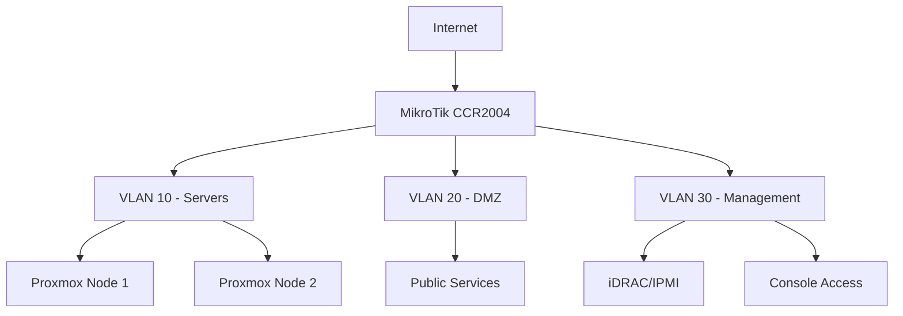

Your homelab started with one Proxmox node and a single Docker container.
Six months later you have three VLANs, a mesh VPN, seven Docker hosts,
a Ceph cluster, and you can't remember which port you mapped for that one
PostgreSQL container. You tell yourself you will document it "next weekend"
— but that weekend never comes.

The documentation problem is the most consistent failure pattern in
homelabbing. Infrastructure grows, knowledge stays in one person's head,
and when something breaks or you rebuild, you reverse-engineer your own
setup from terminal history. There is a better way.

[Docusaurus](https://docusaurus.io/) is a React-based static site
generator designed for technical documentation. It is what Meta uses for
PyTorch, React Native, and dozens of other projects. For your homelab it
means Markdown-native docs with built-in search, versioning, dark mode,
diagrams, and a deployment surface of static HTML — no database, no PHP,
no runtime dependencies.

This guide walks through bootstrapping a Docusaurus documentation site,
running it in Docker behind Traefik with automatic TLS, organizing your
homelab docs, and wiring up webhook-driven auto-builds so your docs stay
current with your infrastructure.

## Why Docusaurus for Homelab Documentation

Before picking a documentation tool, consider what a homelab doc site
actually needs:

- **Markdown-native input.** You want to write docs in your editor, not
  in a rich-text widget. Markdown is version-control friendly, copy-paste
  friendly, and renders beautifully.
- **Static output.** No PHP, no database, no WordPress security patches
  on a Tuesday night. Generate HTML once, serve it forever.
- **Built-in search.** Finding the config for that one VLAN troubleshooting
  page should be two keystrokes, not a grep across 40 files.
- **Versioning.** When you upgrade RouterOS or migrate ZFS pools, tag a
  docs version alongside your infrastructure changes.
- **Dark mode.** Because your terminal is dark and your browser should match.

Docusaurus hits all of these out of the box. It is lightweight, fast,
actively maintained, and has a plugin ecosystem for Mermaid diagrams,
API doc generation, Algolia DocSearch, and more. Compare it to the usual
alternatives:

| Tool        | Static | Search | Versioning | Dark Mode | Markdown |
|-------------|--------|--------|------------|-----------|----------|
| Docusaurus  | ✅      | ✅      | ✅          | ✅         | ✅        |
| MkDocs      | ✅      | ✅      | ⚠️ plugin   | ✅         | ✅        |
| Hugo        | ✅      | ⚠️      | ❌          | ⚠️ theme   | ✅        |
| Bookstack   | ❌      | ✅      | ❌          | ⚠️         | ⚠️        |
| Wiki.js     | ❌      | ✅      | ✅          | ✅         | ✅        |

For a homelab, Docusaurus offers the best balance of features with
zero operational overhead at runtime.

## Bootstrapping the Docusaurus Project

Start by creating a new Docusaurus project on your dev machine or
directly on your Docker host. You can do this from any directory:

```bash
npx create-docusaurus@latest homelab-docs classic
cd homelab-docs
```

This scaffolds the classic template with the default docs plugin, blog
plugin (optional), and a basic homepage. The project structure looks
like:

```
homelab-docs/
├── docs/              # Your Markdown documentation
│   └── intro.md
├── blog/              # Optional blog (changelog, notes)
├── src/               # Custom React pages and components
│   ├── components/
│   └── pages/
├── static/            # Static assets (images, PDFs)
│   └── img/
├── docusaurus.config.ts  # Main configuration
├── sidebars.ts        # Sidebar structure
├── package.json
├── Dockerfile         # We'll create this
└── docker-compose.yml # We'll create this
```

Edit `docusaurus.config.ts` to set your site metadata:

```ts
export default {
  title: 'Homelab Docs',
  tagline: 'Infrastructure documentation for the homelab',
  url: 'https://docs.gntech.me',
  baseUrl: '/',
  favicon: 'img/favicon.ico',
  organizationName: 'gntech',
  projectName: 'homelab-docs',
  onBrokenLinks: 'throw',
  onBrokenMarkdownLinks: 'warn',
  presets: [
    [
      'classic',
      {
        docs: {
          sidebarPath: './sidebars.ts',
          editUrl: 'https://github.com/gntech/homelab-docs/edit/main/',
        },
        blog: false, // Disable blog if you don't need it
        theme: {
          customCss: './src/css/custom.css',
        },
      },
    ],
  ],
  themeConfig: {
    navbar: {
      title: 'Homelab Docs',
      items: [
        { to: '/docs/intro', label: 'Docs', position: 'left' },
        {
          href: 'https://github.com/gntech/homelab-docs',
          label: 'GitHub',
          position: 'right',
        },
      ],
    },
    footer: {
      copyright: `Copyright © ${new Date().getFullYear()} GnTech. Built with Docusaurus.`,
    },
    prism: {
      theme: require('prism-react-renderer').themes.dracula,
      darkTheme: require('prism-react-renderer').themes.dracula,
      additionalLanguages: ['bash', 'docker', 'yaml', 'nginx'],
    },
  },
};
```

Set up your sidebar in `sidebars.ts`:

```ts
const sidebars = {
  tutorialSidebar: [{ type: 'autogenerated', dirName: '.' }],
};
export default sidebars;
```

The `autogenerated` mode scans your `docs/` folder and builds the sidebar
from the folder structure. You can switch to a manual sidebar definition
later if you need fine-grained control over ordering.

## Dockerizing Docusaurus for Self-Hosted Deployment

Running Docusaurus bare-metal requires Node.js, npm, and build tooling on
your host. A Docker container keeps it clean and portable.

### Multi-Stage Dockerfile

Create a `Dockerfile` in the project root:

```dockerfile
# Stage 1: Build
FROM node:20-alpine AS build
WORKDIR /app
COPY package.json package-lock.json ./
RUN npm ci
COPY . .
RUN npm run build

# Stage 2: Serve with Nginx
FROM nginx:stable-alpine
COPY --from=build /app/build /usr/share/nginx/html
COPY nginx.conf /etc/nginx/conf.d/default.conf
EXPOSE 80
CMD ["nginx", "-g", "daemon off;"]
```

This produces a ~10 MB final image — just static files behind Nginx.

### Nginx Configuration

Create `nginx.conf`:

```nginx
server {
    listen 80;
    server_name docs.gntech.me;
    root /usr/share/nginx/html;
    index index.html;

    gzip on;
    gzip_types text/plain text/css application/json application/javascript text/xml application/xml application/xml+rss text/javascript image/svg+xml;

    location / {
        try_files $uri $uri/ /index.html;
    }

    location ~* \.(js|css|png|jpg|jpeg|gif|ico|svg|woff|woff2)$ {
        expires 1y;
        add_header Cache-Control "public, immutable";
    }
}
```

### Docker Compose

Create `docker-compose.yml`:

```yaml
services:
  docs:
    build: .
    container_name: homelab-docs
    restart: unless-stopped
    ports:
      - "127.0.0.1:3000:80"
    labels:
      - "traefik.enable=true"
      - "traefik.http.routers.docs.rule=Host(`docs.gntech.me`)"
      - "traefik.http.routers.docs.entrypoints=websecure"
      - "traefik.http.routers.docs.tls.certresolver=letsencrypt"
      - "traefik.http.services.docs.loadbalancer.server.port=80"
    networks:
      - traefik-proxy

networks:
  traefik-proxy:
    external: true
```

Build and deploy:

```bash
docker compose build
docker compose up -d
```

The site binds on localhost:3000 so only Traefik can reach it directly.
Traefik handles TLS termination and routes `docs.gntech.me` to the
container.

## Reverse Proxy with Traefik

If you are not already using Traefik, here is the complete Traefik
configuration to front your Docusaurus site:

```yaml
# traefik-dynamic.yml
http:
  routers:
    docs:
      rule: "Host(`docs.gntech.me`)"
      entrypoints:
        - websecure
      service: docs
      tls:
        certresolver: letsencrypt
      middlewares:
        - secHeaders
        - compress

  services:
    docs:
      loadBalancer:
        servers:
          - url: "http://192.168.1.100:3000"

  middlewares:
    secHeaders:
      headers:
        frameDeny: true
        sslRedirect: true
        browserXssFilter: true
        contentTypeNosniff: true
        forceSTSHeader: true
        stsIncludeSubdomains: true
        stsPreload: true
        stsSeconds: 31536000
        customFrameOptionsValue: "SAMEORIGIN"

    compress:
      compress:
        excludedContentTypes:
          - text/event-stream
```

This adds security headers, HSTS, and gzip compression. TLS certificates
are issued automatically via Let's Encrypt.

## Organizing Your Homelab Documentation

The hardest part of documentation is not the tool — it is deciding where
to put things. Here is a structure that works well for homelabs:

```
docs/
├── intro.md                       # Overview and topology diagram
├── network/
│   ├── overview.md                # IP scheme, VLANs, subnets
│   ├── mikrotik-routeros.md       # Router config basics
│   ├── firewall-rules.md          # Firewall policy documentation
│   ├── vlan-segmentation.md       # VLAN layout and ACLs
│   └── wireguard-vpn.md           # VPN endpoints and peers
├── servers/
│   ├── proxmox/
│   │   ├── nodes.md               # Hardware specs, host configs
│   │   ├── storage-pools.md       # ZFS layout, pool structure
│   │   └── backup-policies.md     # PBS job schedules, retention
│   └── docker-hosts.md            # Docker engine configs per host
├── services/
│   ├── reverse-proxy.md           # Traefik/Caddy/NGINX configs
│   ├── monitoring.md              # Prometheus, Grafana, Loki
│   ├── dns.md                     # Pi-hole, Unbound, DNS zones
│   └── authentication.md          # Authentik, LDAP, SSO
├── security/
│   ├── crowdsec.md                # CrowdSec deployment and rules
│   ├── firewall-policy.md         # Network-level security policy
│   └── secrets-management.md      # Vaultwarden, SOPS, age keys
├── backups/
│   ├── strategy.md                # 3-2-1 backup strategy overview
│   ├── proxmox-backup.md          # PBS configuration
│   └── docker-backups.md          # Restic, volume dumps
└── changelog/
    └── index.md                   # Track major changes with dates
```

Each page is a Markdown file. Docusaurus renders them as a nested sidebar
automatically. Use frontmatter for page metadata:

```markdown
---
title: MikroTik RouterOS Configuration
description: Current RouterOS 7 configuration for the CCR2004 gateway
sidebar_position: 1
tags: [mikrotik, routeros, networking]
---

# MikroTik RouterOS Configuration

## Hardware
- Model: CCR2004-1G-12S+2XS
- RouterOS: 7.23 stable
- Uplink: GPON ONT via SFP

## Bridge Configuration
...
```

### Including Diagrams with Mermaid

Docusaurus has a first-party Mermaid plugin. Install it:

```bash
npm install --save @docusaurus/theme-mermaid
```

Enable it in `docusaurus.config.ts`:

```ts
module.exports = {
  themes: ['@docusaurus/theme-mermaid'],
  markdown: {
    mermaid: true,
  },
};
```

Now you can embed diagrams directly in your docs:

```markdown

```

This renders as a clean SVG diagram with dark mode support. No external
image hosting needed.

## Auto-Build with GitHub Webhooks

Documentation is only useful if it stays current. Set up a webhook so
that every `git push` rebuilds and redeploys automatically.

### Simple Webhook Listener

Create a small webhook server in `webhook-server/`:

```bash
mkdir -p webhook-server
```

```bash
cat > webhook-server/webhook.sh << 'EOF'
#!/bin/bash
# Simple webhook handler — receives GitHub push events via piping

while true; do
  # Listen on port 8080 with netcat (or use socat)
  echo -e "HTTP/1.1 200 OK\n\n" | nc -l -p 8080 -q 1

  cd /opt/homelab-docs
  git pull origin main
  docker compose build --no-cache
  docker compose up -d --force-recreate
  echo "$(date): Rebuild triggered" >> /var/log/docs-webhook.log
done
EOF

chmod +x webhook-server/webhook.sh
```

For a more robust approach, use a Docker container like
[adnanh/webhook](https://github.com/adnanh/webhook) or configure a
GitHub Actions / GitLab CI pipeline:

### GitHub Actions Workflow

```yaml
# .github/workflows/deploy.yml
name: Deploy Docs
on:
  push:
    branches: [main]

jobs:
  deploy:
    runs-on: ubuntu-latest
    steps:
      - uses: actions/checkout@v4
      - name: Build and deploy via SSH
        uses: appleboy/ssh-action@v1.0.3
        with:
          host: ${{ secrets.HOST }}
          username: ${{ secrets.USER }}
          key: ${{ secrets.SSH_KEY }}
          script: |
            cd /opt/homelab-docs
            git pull origin main
            docker compose build --no-cache
            docker compose up -d --force-recreate
```

This workflow triggers on every push to main, pulls the latest changes
on your homelab server, rebuilds the Docker image, and hot-reloads the
container. Docs go from commit to live in under 30 seconds.

## Search and Navigation Tips

Docusaurus ships with a built-in local search engine powered by
[Lunr.js](https://lunrjs.com/). It indexes all doc pages at build time
and requires no external service. Enable it by setting:

```ts
themeConfig: {
  docs: {
    sidebar: {
      autoCollapseCategories: true,
    },
  },
}
```

For larger sites (100+ pages), switch to Algolia DocSearch:

```ts
themeConfig: {
  algolia: {
    appId: 'YOUR_APP_ID',
    apiKey: 'YOUR_SEARCH_API_KEY',
    indexName: 'homelab-docs',
  },
}
```

Either way, your search bar indexes titles, headings, and body content.
Results appear in an overlay with keyboard navigation.

### Navigation Best Practices

- **Use categories sparingly.** Three levels deep max. If you need more,
  your structure is too nested.
- **Link between pages.** When you mention a service like Pi-hole or
  Authentik, link to its dedicated page. Docusaurus handles relative
  links from the `docs/` base.
- **Tag liberally.** Multi-tag pages appear in search results via the
  tag system. Tags are rendered at the bottom of each page.
- **Keep the intro page up to date.** It is the first thing people see
  and the best place for a high-level diagram and hardware inventory.

## Conclusion

A Docusaurus documentation site solves the most consistent failure
pattern in homelabbing: undocumented infrastructure. It is Markdown-
native, statically served, searchable, versioned, and runs in a
lightweight Docker container behind Traefik with automatic TLS.

The full stack is:

- **Docusaurus** for the documentation framework
- **Docker + Nginx** for the runtime (static files, ~10 MB image)
- **Traefik** for TLS termination and reverse proxy
- **GitHub** for version control and collaboration
- **Webhooks or GitHub Actions** for auto-deploy on push

Start with one page — your network topology. Add VLAN tables next.
Before long you have a living document that saves you hours every time
you troubleshoot, rebuild, or expand your homelab.

The best time to start documenting was when you plugged in the first
switch. The second best time is right now.
