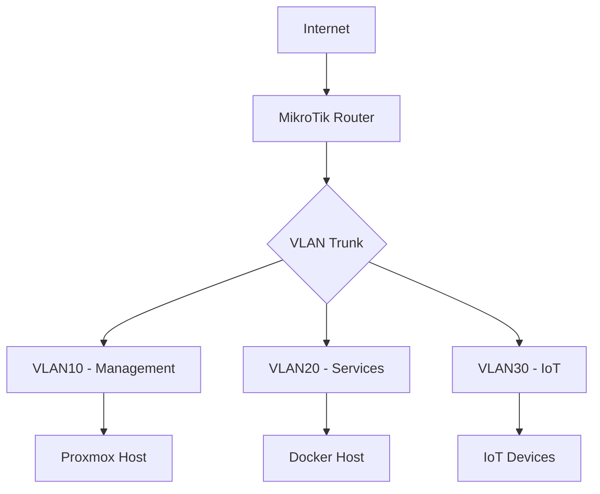

Documenting your homelab is one of those tasks everyone puts off — until you need to remember why you configured that VLAN or where the WireGuard peer config lives. A proper documentation site solves this, and Docusaurus is an excellent choice for homelabbers who prefer static sites, Git workflows, and Markdown-driven content.

## Why Docusaurus for Homelab Documentation

Several tools exist for homelab documentation. Here is how they compare:

| Feature | Docusaurus | BookStack | Outline | Wiki.js |
|---------|-----------|-----------|---------|---------|
| Content format | Markdown/MDX | WYSIWYG | Markdown | Markdown |
| Storage | Git repo | MySQL/MariaDB | PostgreSQL | PostgreSQL |
| Versioning | Built-in | Manual | Manual | Plugin |
| Search | Local or Algolia | Built-in | Built-in | Elasticsearch |
| Deployment | Static site (CDN/docker) | Docker + DB | Docker + DB | Docker + DB |
| Customization | React/JSX | Templating | Limited | JS |

Docusaurus wins on **portability** — your docs are plain Markdown files in a Git repo. No database, no WYSIWYG lock-in. You can edit in any editor, version with Git tags, and deploy to anything from a Docker container to Cloudflare Pages or GitHub Pages.

## Installation and Project Scaffolding

You need Node.js 18 or later and a Git repository.

```
npx create-docusaurus@latest my-lab-docs classic
cd my-lab-docs && npx docusaurus start
```

This creates the project skeleton:

```
my-lab-docs/
├── blog/                  # Optional blog section
├── docs/                  # Your documentation (Markdown)
│   ├── intro.md
│   └── tutorial/
├── src/
│   ├── components/        # Custom React components
│   ├── css/               # Custom styles
│   └── pages/             # Standalone pages
├── static/                # Static assets (images, files)
├── docusaurus.config.js   # Main configuration
├── sidebars.js            # Sidebar structure
├── package.json
└── Dockerfile             # You will add this
```

Run `npx docusaurus start` to preview at `http://localhost:3000`.

## Configuration and Customization

Edit `docusaurus.config.js` to set your site metadata:

```js
module.exports = {
  title: 'GnTech Lab Docs',
  tagline: 'Homelab documentation and runbooks',
  url: 'https://docs.gntech.me',
  baseUrl: '/',
  organizationName: 'gntech',
  projectName: 'lab-docs',

  themeConfig: {
    navbar: {
      title: 'GnTech Lab',
      logo: {
        alt: 'GnTech Logo',
        src: 'img/logo.svg',
      },
      items: [
        { type: 'doc', docId: 'intro', position: 'left', label: 'Docs' },
        { to: '/blog', label: 'Blog', position: 'left' },
        {
          href: 'https://github.com/gntech/lab-docs',
          label: 'GitHub',
          position: 'right',
        },
      ],
    },
    footer: {
      style: 'dark',
      links: [
        { title: 'Docs', items: [
          { label: 'Getting Started', to: '/docs/intro' },
          { label: 'Networking', to: '/docs/networking/overview' },
          { label: 'Proxmox', to: '/docs/proxmox/overview' },
        ]},
      ],
    },
  },
};
```

### Custom CSS

Override the Docusaurus theme colors in `src/css/custom.css`:

```css
:root {
  --ifm-color-primary: #2e8555;
  --ifm-color-primary-dark: #29784c;
  --ifm-color-primary-light: #33925d;
}

[data-theme='dark'] {
  --ifm-color-primary: #25c2a0;
  --ifm-color-primary-dark: #21af90;
}
```

Docusaurus respects the system color scheme by default and switches seamlessly between light and dark modes.

## Writing Documentation — Sidebars and MDX

### Sidebar Configuration

You have two options: auto-generated or manual sidebars.

**Auto-generated** (simplest — just use the file structure):

```js
// sidebars.js
module.exports = {
  docs: [{ type: 'autogenerated', dirName: '.' }],
};
```

**Manual** (full control):

```js
// sidebars.js
module.exports = {
  docs: [
    {
      type: 'category',
      label: 'Getting Started',
      items: ['intro', 'quickstart'],
    },
    {
      type: 'category',
      label: 'Networking',
      items: [
        'networking/overview',
        'networking/vlan-topology',
        'networking/mikrotik-firewall',
        'networking/wireguard-vpn',
      ],
    },
    {
      type: 'category',
      label: 'Proxmox',
      items: [
        'proxmox/overview',
        'proxmox/zfs-pool-layout',
        'proxmox/backup-strategy',
      ],
    },
  ],
};
```

### MDX Features for Homelab Docs

Docusaurus uses MDX — Markdown with inline JSX. Useful features for technical docs:

**Admonitions:**

```md
:::tip
Always use non-root containers. Set `user: "1000:1000"` in your Compose files.
:::

:::caution
Bridge VLAN filtering disables hardware offload when combined with IGMP snooping.
:::

:::danger
Never expose your Docker socket to untrusted containers.
:::
```

**Tabs for multi-platform configs:**

Docusaurus supports MDX tabs natively:

```md
import Tabs from '@theme/Tabs';
import TabItem from '@theme/TabItem';

<Tabs>
<TabItem value="docker" label="Docker">
  Run directly: `docker run -d --name=nginx nginx:alpine`
</TabItem>
<TabItem value="compose" label="Docker Compose">
  Use Compose:
  ```yaml
  services:
    nginx:
      image: nginx:alpine
  ```
</TabItem>
</Tabs>
```

**Mermaid diagrams for network topology:**

````md

````

## Adding Search

For a self-hosted homelab docs site, the local search plugin works best:

```bash
npm install --save @easyops-cn/docusaurus-search-local
```

Then add it to `docusaurus.config.js`:

```js
plugins: [
  [
    require.resolve('@easyops-cn/docusaurus-search-local'),
    {
      hashed: true,
      language: ['en'],
      highlightSearchTermsOnTargetPage: true,
      explicitSearchResultPath: true,
    },
  ],
],
```

For public documentation, Algolia DocSearch is also available (free for open-source projects).

## Versioning Your Documentation

Docusaurus versioning lets you tag releases of your docs to match infrastructure changes:

```bash
npx docusaurus docs:version 1.0
npx docusaurus docs:version 2.0
```

This creates `versioned_docs/version-1.0/` and `versioned_docs/version-2.0/`. Readers can switch versions from a dropdown in the navbar.

Use versioning when your infrastructure goes through significant changes — for example, after migrating from RouterOS 6 to 7, or upgrading Proxmox to a new major release. Each version retains its own sidebar configuration in `versioned_sidebars/`.

## Docker Deployment

A multi-stage Docker build produces a small, production-ready image:

### Dockerfile

```dockerfile
FROM node:20-alpine AS build
WORKDIR /app
COPY package*.json ./
RUN npm ci
COPY . .
RUN npm run build

FROM nginx:alpine
COPY --from=build /app/build /usr/share/nginx/html
COPY nginx.conf /etc/nginx/conf.d/default.conf
EXPOSE 80
CMD ["nginx", "-g", "daemon off;"]
```

### nginx.conf

```nginx
server {
    listen       80;
    server_name  docs.gntech.me;
    root   /usr/share/nginx/html;
    index  index.html;

    location / {
        try_files $uri $uri/ /index.html;
    }

    # Cache static assets
    location /assets/ {
        expires 1y;
        add_header Cache-Control "public, immutable";
    }
}
```

### docker-compose.yml

```yaml
services:
  docusaurus:
    build: .
    container_name: lab-docs
    restart: unless-stopped
    ports:
      - "3000:80"
    labels:
      - "traefik.enable=true"
      - "traefik.http.routers.docs.rule=Host(`docs.gntech.me`)"
      - "traefik.http.routers.docs.entrypoints=websecure"
      - "traefik.http.routers.docs.tls.certresolver=letsencrypt"
      - "traefik.http.services.docs.loadbalancer.server.port=80"
```

### Build and Deploy

```bash
docker compose build
docker compose up -d
```

The site is now running behind Traefik with automatic Let's Encrypt SSL.

## GitOps Workflow

The real power of Docusaurus comes from treating your docs as code.

### Gitea Actions Example

```yaml
# .gitea/workflows/deploy-docs.yml
name: Build and Deploy Docs
on:
  push:
    branches: [main]

jobs:
  build:
    runs-on: ubuntu-latest
    steps:
      - uses: actions/checkout@v4
      - uses: actions/setup-node@v4
        with:
          node-version: 20
      - run: npm ci
      - run: npm run build
      - name: Deploy to Docker host
        run: |
          docker compose build
          docker compose up -d --force-recreate
        env:
          DOCKER_HOST: ssh://deploy@10.0.20.30
```

With this workflow, every push to `main` automatically rebuilds and redeploys the docs site. No manual steps, no SSH sessions — just `git push`.

### Cloudflare Pages Alternative

If you prefer a managed CDN, connect your Git repo to Cloudflare Pages. Set the build command to `npm run build` and the output directory to `build`. Cloudflare handles SSL, edge caching, and global distribution automatically with zero infrastructure to maintain.

## Conclusion

Docusaurus gives you a professional documentation site with zero runtime dependencies. No database, no PHP, no WYSIWYG editor to fight with. Just Markdown files in a Git repo, with built-in search, versioning, and a clean dark-mode theme that your eyes will thank you for.

For homelab environments where your infrastructure evolves frequently, Docusaurus excels because it forces you into a Git-based workflow — every update is tracked, reviewable, and deployable through CI/CD. Combined with Docker for self-hosting or Cloudflare Pages for global delivery, it is one of the lowest-maintenance documentation tools you can run.

For more details, see the [official Docusaurus documentation](https://docusaurus.io/docs).
